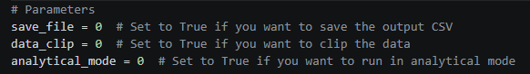
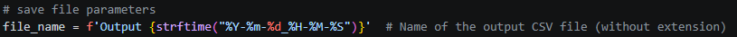
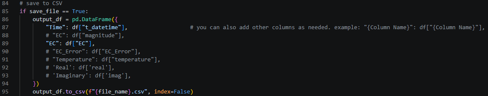
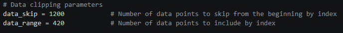
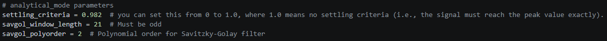

* Make sure **Python** is installed on your system.
* Install the required dependencies by running the following command in your terminal:
  ```
  pip install -r requirements.txt
  ```
* Launch the application by running:
  ```
  python scope.py
  ```
* When prompted, select the CSV file you want to analyze.


Scope.py









